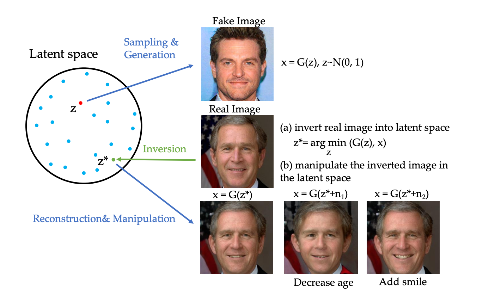

# EC523 Project -- GAN Inversion
Diana Arguijo, Shashank Manjunath, Frank Pacini, Zhenghang Yin  
`{dma25, manjuns, fgpacini, johnyin}@bu.edu`  

Code for encoders based on: `https://github.com/yuval-alaluf/restyle-encoder`.  
Code for InterFaceGAN based on `https://github.com/genforce/interfacegan`.  
Code for age estimation based on `https://github.com/yu4u/age-estimation-pytorch`.

**Figure 1:** *GAN Inversion [1]. Models take in a target image, and search the latent space for a latent encoding which
produces an image most similar to the target image. The latent encoding is then manipulated to add new features to the
image.*

## Project Objective

GANs have shown remarkable results on image synthesis tasks, with models such as StyleGAN2 and Projected GAN achieving
state-of-the-art results on generating images such as human faces and generating buildings. While these models can map a
random latent vector to a novel image of interest, there is little a priori control over the image that is generated.
The field of GAN inversion. A recent line of work involves inverting this forward model in a process called GAN
inversion, which is  shown in Figure 1. In this image-to-image translation task, we train an encoder which map a real
image into the latent space of a pretrained GAN, such that the latent code produces an almost identical generated copy
of the image. Such an encoder allows identification of the latent variable that corresponds to a real image, which can
then be used in applications which modify the latent codes. However, few of these GAN inversion models leverage
long-range interactions within images, and rather use convolutional neural networks to try and map an unknown image into
the latent space of another GAN model. In this work, we aim to leverage existing GAN inversion models and techniques,
such as StyleGAN, and pixel2Style2pixel (pSp) modified with attention mechanisms in order to improve GAN inversion
performance. Following these methods, for training we will use the FFHQ  dataset, which contains 70,000 high-quality
1024x1024 images of human faces.

## Instructions

For instructions on how to train encoders, please see the `gan_inversion` directory. For instructions on how to run
the InterFaceGAN face editing system for age, please see the `interfacegan` directory.

## References

[1] W. Xia et al.. GAN inversion: A survey. arXiv preprint arXiv:2101.05278, 2021.
